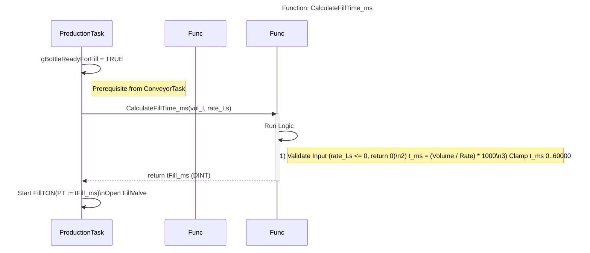

```mermaid
sequenceDiagram
title Function: CalculateFillTime_ms

participant ProductionTask
participant "CalculateFillTime_ms()" as Func

ProductionTask ->> ProductionTask: gBottleReadyForFill = TRUE
Note right of ProductionTask: Prerequisite from ConveyorTask

ProductionTask ->> Func: CalculateFillTime_ms(vol_l, rate_Ls)
activate Func

Func ->> Func: Run Logic
Note right of Func: 1) Validate Input (rate_Ls <= 0, return 0)\n2) t_ms = (Volume / Rate) * 1000\n3) Clamp t_ms 0..60000

Func -->> ProductionTask: return tFill_ms (DINT)
deactivate Func

ProductionTask ->> ProductionTask: Start FillTON(PT := tFill_ms)\nOpen FillValve

```